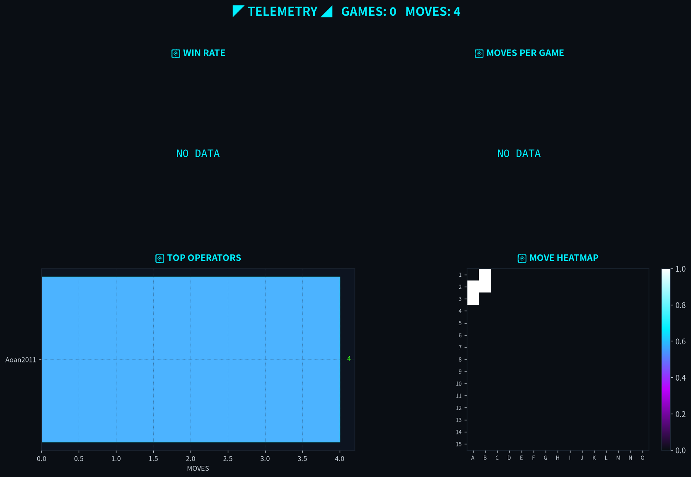

<div align="center">


</div>

```text
╔══════════════════════════════════════════════════════════════╗
║  GOMOKU ENGINE v1.0     STATUS: [ WHITE_TURN ]               ║
║  GAME ID : 1        MOVE : 5        LAST : A3                ║
╠══════════════════════════════════════════════════════════════╣
║  FEATURED: One-Editor [ Textual TUI Editor ]                 ║
╚══════════════════════════════════════════════════════════════╝
```


```text
╔══════════════════════════════════════════════════════════════╗
║  ◤ BOARD ASCII VIEW ◢                                        ║
║                                                              ║
║    [B] = Black   [W] = White   [.] = Empty                   ║
║    [b] / [w] = LAST MOVE (highlighted)                       ║
║                                                              ║
╠══════════════════════════════════════════════════════════════╣
║                                                              ║
║                  A B C D E F G H I J K L M N O               ║
║               1  B W . . . . . . . . . . . . .               ║
║               2  B W . . . . . . . . . . . . .               ║
║               3  b . . . . . . . . . . . . . .               ║
║               4  . . . . . . . . . . . . . . .               ║
║               5  . . . . . . . . . . . . . . .               ║
║               6  . . . . . . . . . . . . . . .               ║
║               7  . . . . . . . . . . . . . . .               ║
║               8  . . . . . . . . . . . . . . .               ║
║               9  . . . . . . . . . . . . . . .               ║
║              10  . . . . . . . . . . . . . . .               ║
║              11  . . . . . . . . . . . . . . .               ║
║              12  . . . . . . . . . . . . . . .               ║
║              13  . . . . . . . . . . . . . . .               ║
║              14  . . . . . . . . . . . . . . .               ║
║              15  . . . . . . . . . . . . . . .               ║
║                                                              ║
╠══════════════════════════════════════════════════════════════╣
║                                                              ║
║                     >>>  SCROLL DOWN TO PLAY  <<<            ║
║                                                              ║
║                 Click any [ . ] on the board below           ║
║                        to place your stone                   ║
║                                                              ║
╚══════════════════════════════════════════════════════════════╝
```

<div align="center">

### 👇 轮到 白方 ⚪ 落子 👇

> 点击**下方棋盘**上的任意 `·`
> → 自动创建 Issue
> → 点 **Submit new issue**
> → 30 秒后棋盘自动更新

**棋盘坐标**：列 `A~O` × 行 `1~15`，例如 `H8` 表示第 8 行第 H 列

</div>


```text
╔══════════════════════════════════════════════════════════════╗
║  ◤ CURRENT SITUATION ◢                                       ║
╠══════════════════════════════════════════════════════════════╣
║  BLACK [B] : 3   stones     WHITE [W] : 2   stones           ║
║  TOTAL     : 5   stones     TURN      : WHITE_TURN           ║
╠══════════════════════════════════════════════════════════════╣
║  RECENT MOVES                                                ║
║      4.  B  A3    by Aoan2011              <- last           ║
║      3.  W  B2    by Aoan2011                                ║
║      2.  B  A2    by Aoan2011                                ║
║      1.  W  B1    by Aoan2011                                ║
╠══════════════════════════════════════════════════════════════╣
║  PLAYERS                                                     ║
║    [B]  Aoan2011                                             ║
║    [W]  Aoan2011                                             ║
╚══════════════════════════════════════════════════════════════╝
```


```text
╔══════════════════════════════════════════════════════════════╗
║  ◤ ANALYSIS & HISTORY ◢                                      ║
╠══════════════════════════════════════════════════════════════╣
║  WIN RATE  : BLACK  50%   |   WHITE  50%                     ║
║  THREATS   : BLACK 3x0 4x0   |   WHITE 3x0 4x0               ║
╠══════════════════════════════════════════════════════════════╣
║  RECENT GAMES                                                ║
║    (no completed games yet)                                  ║
╠══════════════════════════════════════════════════════════════╣
║  ACTIVE (last 24h)                                           ║
║    Aoan2011                             4 moves              ║
╚══════════════════════════════════════════════════════════════╝
```

---

## ▸ FEATURED PROJECT

<div align="center">

<a href="https://github.com/Aoan2011/One-Editor">

</a>


### [`One-Editor`](https://github.com/Aoan2011/One-Editor)

> `TUI Editor` · Built with **Textual** · Python · 在终端里书写代码的全新方式

</div>

---

## ▸ BOARD — CLICK TO PLAY

> 当前回合 **白方 ⚪** ｜ 点击下方任意 `·` 落子

|   |**A**|**B**|**C**|**D**|**E**|**F**|**G**|**H**|**I**|**J**|**K**|**L**|**M**|**N**|**O**|
|:---:|:---:|:---:|:---:|:---:|:---:|:---:|:---:|:---:|:---:|:---:|:---:|:---:|:---:|:---:|:---:|
|**1**|●|○|[·](https://github.com/Aoan2011/Aoan2011/issues/new?title=gomoku%7Cplace%7CC1&body=点击Submit落子)|[·](https://github.com/Aoan2011/Aoan2011/issues/new?title=gomoku%7Cplace%7CD1&body=点击Submit落子)|[·](https://github.com/Aoan2011/Aoan2011/issues/new?title=gomoku%7Cplace%7CE1&body=点击Submit落子)|[·](https://github.com/Aoan2011/Aoan2011/issues/new?title=gomoku%7Cplace%7CF1&body=点击Submit落子)|[·](https://github.com/Aoan2011/Aoan2011/issues/new?title=gomoku%7Cplace%7CG1&body=点击Submit落子)|[·](https://github.com/Aoan2011/Aoan2011/issues/new?title=gomoku%7Cplace%7CH1&body=点击Submit落子)|[·](https://github.com/Aoan2011/Aoan2011/issues/new?title=gomoku%7Cplace%7CI1&body=点击Submit落子)|[·](https://github.com/Aoan2011/Aoan2011/issues/new?title=gomoku%7Cplace%7CJ1&body=点击Submit落子)|[·](https://github.com/Aoan2011/Aoan2011/issues/new?title=gomoku%7Cplace%7CK1&body=点击Submit落子)|[·](https://github.com/Aoan2011/Aoan2011/issues/new?title=gomoku%7Cplace%7CL1&body=点击Submit落子)|[·](https://github.com/Aoan2011/Aoan2011/issues/new?title=gomoku%7Cplace%7CM1&body=点击Submit落子)|[·](https://github.com/Aoan2011/Aoan2011/issues/new?title=gomoku%7Cplace%7CN1&body=点击Submit落子)|[·](https://github.com/Aoan2011/Aoan2011/issues/new?title=gomoku%7Cplace%7CO1&body=点击Submit落子)|
|**2**|●|○|[·](https://github.com/Aoan2011/Aoan2011/issues/new?title=gomoku%7Cplace%7CC2&body=点击Submit落子)|[·](https://github.com/Aoan2011/Aoan2011/issues/new?title=gomoku%7Cplace%7CD2&body=点击Submit落子)|[·](https://github.com/Aoan2011/Aoan2011/issues/new?title=gomoku%7Cplace%7CE2&body=点击Submit落子)|[·](https://github.com/Aoan2011/Aoan2011/issues/new?title=gomoku%7Cplace%7CF2&body=点击Submit落子)|[·](https://github.com/Aoan2011/Aoan2011/issues/new?title=gomoku%7Cplace%7CG2&body=点击Submit落子)|[·](https://github.com/Aoan2011/Aoan2011/issues/new?title=gomoku%7Cplace%7CH2&body=点击Submit落子)|[·](https://github.com/Aoan2011/Aoan2011/issues/new?title=gomoku%7Cplace%7CI2&body=点击Submit落子)|[·](https://github.com/Aoan2011/Aoan2011/issues/new?title=gomoku%7Cplace%7CJ2&body=点击Submit落子)|[·](https://github.com/Aoan2011/Aoan2011/issues/new?title=gomoku%7Cplace%7CK2&body=点击Submit落子)|[·](https://github.com/Aoan2011/Aoan2011/issues/new?title=gomoku%7Cplace%7CL2&body=点击Submit落子)|[·](https://github.com/Aoan2011/Aoan2011/issues/new?title=gomoku%7Cplace%7CM2&body=点击Submit落子)|[·](https://github.com/Aoan2011/Aoan2011/issues/new?title=gomoku%7Cplace%7CN2&body=点击Submit落子)|[·](https://github.com/Aoan2011/Aoan2011/issues/new?title=gomoku%7Cplace%7CO2&body=点击Submit落子)|
|**3**|●|[·](https://github.com/Aoan2011/Aoan2011/issues/new?title=gomoku%7Cplace%7CB3&body=点击Submit落子)|[·](https://github.com/Aoan2011/Aoan2011/issues/new?title=gomoku%7Cplace%7CC3&body=点击Submit落子)|[·](https://github.com/Aoan2011/Aoan2011/issues/new?title=gomoku%7Cplace%7CD3&body=点击Submit落子)|[·](https://github.com/Aoan2011/Aoan2011/issues/new?title=gomoku%7Cplace%7CE3&body=点击Submit落子)|[·](https://github.com/Aoan2011/Aoan2011/issues/new?title=gomoku%7Cplace%7CF3&body=点击Submit落子)|[·](https://github.com/Aoan2011/Aoan2011/issues/new?title=gomoku%7Cplace%7CG3&body=点击Submit落子)|[·](https://github.com/Aoan2011/Aoan2011/issues/new?title=gomoku%7Cplace%7CH3&body=点击Submit落子)|[·](https://github.com/Aoan2011/Aoan2011/issues/new?title=gomoku%7Cplace%7CI3&body=点击Submit落子)|[·](https://github.com/Aoan2011/Aoan2011/issues/new?title=gomoku%7Cplace%7CJ3&body=点击Submit落子)|[·](https://github.com/Aoan2011/Aoan2011/issues/new?title=gomoku%7Cplace%7CK3&body=点击Submit落子)|[·](https://github.com/Aoan2011/Aoan2011/issues/new?title=gomoku%7Cplace%7CL3&body=点击Submit落子)|[·](https://github.com/Aoan2011/Aoan2011/issues/new?title=gomoku%7Cplace%7CM3&body=点击Submit落子)|[·](https://github.com/Aoan2011/Aoan2011/issues/new?title=gomoku%7Cplace%7CN3&body=点击Submit落子)|[·](https://github.com/Aoan2011/Aoan2011/issues/new?title=gomoku%7Cplace%7CO3&body=点击Submit落子)|
|**4**|[·](https://github.com/Aoan2011/Aoan2011/issues/new?title=gomoku%7Cplace%7CA4&body=点击Submit落子)|[·](https://github.com/Aoan2011/Aoan2011/issues/new?title=gomoku%7Cplace%7CB4&body=点击Submit落子)|[·](https://github.com/Aoan2011/Aoan2011/issues/new?title=gomoku%7Cplace%7CC4&body=点击Submit落子)|[·](https://github.com/Aoan2011/Aoan2011/issues/new?title=gomoku%7Cplace%7CD4&body=点击Submit落子)|[·](https://github.com/Aoan2011/Aoan2011/issues/new?title=gomoku%7Cplace%7CE4&body=点击Submit落子)|[·](https://github.com/Aoan2011/Aoan2011/issues/new?title=gomoku%7Cplace%7CF4&body=点击Submit落子)|[·](https://github.com/Aoan2011/Aoan2011/issues/new?title=gomoku%7Cplace%7CG4&body=点击Submit落子)|[·](https://github.com/Aoan2011/Aoan2011/issues/new?title=gomoku%7Cplace%7CH4&body=点击Submit落子)|[·](https://github.com/Aoan2011/Aoan2011/issues/new?title=gomoku%7Cplace%7CI4&body=点击Submit落子)|[·](https://github.com/Aoan2011/Aoan2011/issues/new?title=gomoku%7Cplace%7CJ4&body=点击Submit落子)|[·](https://github.com/Aoan2011/Aoan2011/issues/new?title=gomoku%7Cplace%7CK4&body=点击Submit落子)|[·](https://github.com/Aoan2011/Aoan2011/issues/new?title=gomoku%7Cplace%7CL4&body=点击Submit落子)|[·](https://github.com/Aoan2011/Aoan2011/issues/new?title=gomoku%7Cplace%7CM4&body=点击Submit落子)|[·](https://github.com/Aoan2011/Aoan2011/issues/new?title=gomoku%7Cplace%7CN4&body=点击Submit落子)|[·](https://github.com/Aoan2011/Aoan2011/issues/new?title=gomoku%7Cplace%7CO4&body=点击Submit落子)|
|**5**|[·](https://github.com/Aoan2011/Aoan2011/issues/new?title=gomoku%7Cplace%7CA5&body=点击Submit落子)|[·](https://github.com/Aoan2011/Aoan2011/issues/new?title=gomoku%7Cplace%7CB5&body=点击Submit落子)|[·](https://github.com/Aoan2011/Aoan2011/issues/new?title=gomoku%7Cplace%7CC5&body=点击Submit落子)|[·](https://github.com/Aoan2011/Aoan2011/issues/new?title=gomoku%7Cplace%7CD5&body=点击Submit落子)|[·](https://github.com/Aoan2011/Aoan2011/issues/new?title=gomoku%7Cplace%7CE5&body=点击Submit落子)|[·](https://github.com/Aoan2011/Aoan2011/issues/new?title=gomoku%7Cplace%7CF5&body=点击Submit落子)|[·](https://github.com/Aoan2011/Aoan2011/issues/new?title=gomoku%7Cplace%7CG5&body=点击Submit落子)|[·](https://github.com/Aoan2011/Aoan2011/issues/new?title=gomoku%7Cplace%7CH5&body=点击Submit落子)|[·](https://github.com/Aoan2011/Aoan2011/issues/new?title=gomoku%7Cplace%7CI5&body=点击Submit落子)|[·](https://github.com/Aoan2011/Aoan2011/issues/new?title=gomoku%7Cplace%7CJ5&body=点击Submit落子)|[·](https://github.com/Aoan2011/Aoan2011/issues/new?title=gomoku%7Cplace%7CK5&body=点击Submit落子)|[·](https://github.com/Aoan2011/Aoan2011/issues/new?title=gomoku%7Cplace%7CL5&body=点击Submit落子)|[·](https://github.com/Aoan2011/Aoan2011/issues/new?title=gomoku%7Cplace%7CM5&body=点击Submit落子)|[·](https://github.com/Aoan2011/Aoan2011/issues/new?title=gomoku%7Cplace%7CN5&body=点击Submit落子)|[·](https://github.com/Aoan2011/Aoan2011/issues/new?title=gomoku%7Cplace%7CO5&body=点击Submit落子)|
|**6**|[·](https://github.com/Aoan2011/Aoan2011/issues/new?title=gomoku%7Cplace%7CA6&body=点击Submit落子)|[·](https://github.com/Aoan2011/Aoan2011/issues/new?title=gomoku%7Cplace%7CB6&body=点击Submit落子)|[·](https://github.com/Aoan2011/Aoan2011/issues/new?title=gomoku%7Cplace%7CC6&body=点击Submit落子)|[·](https://github.com/Aoan2011/Aoan2011/issues/new?title=gomoku%7Cplace%7CD6&body=点击Submit落子)|[·](https://github.com/Aoan2011/Aoan2011/issues/new?title=gomoku%7Cplace%7CE6&body=点击Submit落子)|[·](https://github.com/Aoan2011/Aoan2011/issues/new?title=gomoku%7Cplace%7CF6&body=点击Submit落子)|[·](https://github.com/Aoan2011/Aoan2011/issues/new?title=gomoku%7Cplace%7CG6&body=点击Submit落子)|[·](https://github.com/Aoan2011/Aoan2011/issues/new?title=gomoku%7Cplace%7CH6&body=点击Submit落子)|[·](https://github.com/Aoan2011/Aoan2011/issues/new?title=gomoku%7Cplace%7CI6&body=点击Submit落子)|[·](https://github.com/Aoan2011/Aoan2011/issues/new?title=gomoku%7Cplace%7CJ6&body=点击Submit落子)|[·](https://github.com/Aoan2011/Aoan2011/issues/new?title=gomoku%7Cplace%7CK6&body=点击Submit落子)|[·](https://github.com/Aoan2011/Aoan2011/issues/new?title=gomoku%7Cplace%7CL6&body=点击Submit落子)|[·](https://github.com/Aoan2011/Aoan2011/issues/new?title=gomoku%7Cplace%7CM6&body=点击Submit落子)|[·](https://github.com/Aoan2011/Aoan2011/issues/new?title=gomoku%7Cplace%7CN6&body=点击Submit落子)|[·](https://github.com/Aoan2011/Aoan2011/issues/new?title=gomoku%7Cplace%7CO6&body=点击Submit落子)|
|**7**|[·](https://github.com/Aoan2011/Aoan2011/issues/new?title=gomoku%7Cplace%7CA7&body=点击Submit落子)|[·](https://github.com/Aoan2011/Aoan2011/issues/new?title=gomoku%7Cplace%7CB7&body=点击Submit落子)|[·](https://github.com/Aoan2011/Aoan2011/issues/new?title=gomoku%7Cplace%7CC7&body=点击Submit落子)|[·](https://github.com/Aoan2011/Aoan2011/issues/new?title=gomoku%7Cplace%7CD7&body=点击Submit落子)|[·](https://github.com/Aoan2011/Aoan2011/issues/new?title=gomoku%7Cplace%7CE7&body=点击Submit落子)|[·](https://github.com/Aoan2011/Aoan2011/issues/new?title=gomoku%7Cplace%7CF7&body=点击Submit落子)|[·](https://github.com/Aoan2011/Aoan2011/issues/new?title=gomoku%7Cplace%7CG7&body=点击Submit落子)|[·](https://github.com/Aoan2011/Aoan2011/issues/new?title=gomoku%7Cplace%7CH7&body=点击Submit落子)|[·](https://github.com/Aoan2011/Aoan2011/issues/new?title=gomoku%7Cplace%7CI7&body=点击Submit落子)|[·](https://github.com/Aoan2011/Aoan2011/issues/new?title=gomoku%7Cplace%7CJ7&body=点击Submit落子)|[·](https://github.com/Aoan2011/Aoan2011/issues/new?title=gomoku%7Cplace%7CK7&body=点击Submit落子)|[·](https://github.com/Aoan2011/Aoan2011/issues/new?title=gomoku%7Cplace%7CL7&body=点击Submit落子)|[·](https://github.com/Aoan2011/Aoan2011/issues/new?title=gomoku%7Cplace%7CM7&body=点击Submit落子)|[·](https://github.com/Aoan2011/Aoan2011/issues/new?title=gomoku%7Cplace%7CN7&body=点击Submit落子)|[·](https://github.com/Aoan2011/Aoan2011/issues/new?title=gomoku%7Cplace%7CO7&body=点击Submit落子)|
|**8**|[·](https://github.com/Aoan2011/Aoan2011/issues/new?title=gomoku%7Cplace%7CA8&body=点击Submit落子)|[·](https://github.com/Aoan2011/Aoan2011/issues/new?title=gomoku%7Cplace%7CB8&body=点击Submit落子)|[·](https://github.com/Aoan2011/Aoan2011/issues/new?title=gomoku%7Cplace%7CC8&body=点击Submit落子)|[·](https://github.com/Aoan2011/Aoan2011/issues/new?title=gomoku%7Cplace%7CD8&body=点击Submit落子)|[·](https://github.com/Aoan2011/Aoan2011/issues/new?title=gomoku%7Cplace%7CE8&body=点击Submit落子)|[·](https://github.com/Aoan2011/Aoan2011/issues/new?title=gomoku%7Cplace%7CF8&body=点击Submit落子)|[·](https://github.com/Aoan2011/Aoan2011/issues/new?title=gomoku%7Cplace%7CG8&body=点击Submit落子)|[·](https://github.com/Aoan2011/Aoan2011/issues/new?title=gomoku%7Cplace%7CH8&body=点击Submit落子)|[·](https://github.com/Aoan2011/Aoan2011/issues/new?title=gomoku%7Cplace%7CI8&body=点击Submit落子)|[·](https://github.com/Aoan2011/Aoan2011/issues/new?title=gomoku%7Cplace%7CJ8&body=点击Submit落子)|[·](https://github.com/Aoan2011/Aoan2011/issues/new?title=gomoku%7Cplace%7CK8&body=点击Submit落子)|[·](https://github.com/Aoan2011/Aoan2011/issues/new?title=gomoku%7Cplace%7CL8&body=点击Submit落子)|[·](https://github.com/Aoan2011/Aoan2011/issues/new?title=gomoku%7Cplace%7CM8&body=点击Submit落子)|[·](https://github.com/Aoan2011/Aoan2011/issues/new?title=gomoku%7Cplace%7CN8&body=点击Submit落子)|[·](https://github.com/Aoan2011/Aoan2011/issues/new?title=gomoku%7Cplace%7CO8&body=点击Submit落子)|
|**9**|[·](https://github.com/Aoan2011/Aoan2011/issues/new?title=gomoku%7Cplace%7CA9&body=点击Submit落子)|[·](https://github.com/Aoan2011/Aoan2011/issues/new?title=gomoku%7Cplace%7CB9&body=点击Submit落子)|[·](https://github.com/Aoan2011/Aoan2011/issues/new?title=gomoku%7Cplace%7CC9&body=点击Submit落子)|[·](https://github.com/Aoan2011/Aoan2011/issues/new?title=gomoku%7Cplace%7CD9&body=点击Submit落子)|[·](https://github.com/Aoan2011/Aoan2011/issues/new?title=gomoku%7Cplace%7CE9&body=点击Submit落子)|[·](https://github.com/Aoan2011/Aoan2011/issues/new?title=gomoku%7Cplace%7CF9&body=点击Submit落子)|[·](https://github.com/Aoan2011/Aoan2011/issues/new?title=gomoku%7Cplace%7CG9&body=点击Submit落子)|[·](https://github.com/Aoan2011/Aoan2011/issues/new?title=gomoku%7Cplace%7CH9&body=点击Submit落子)|[·](https://github.com/Aoan2011/Aoan2011/issues/new?title=gomoku%7Cplace%7CI9&body=点击Submit落子)|[·](https://github.com/Aoan2011/Aoan2011/issues/new?title=gomoku%7Cplace%7CJ9&body=点击Submit落子)|[·](https://github.com/Aoan2011/Aoan2011/issues/new?title=gomoku%7Cplace%7CK9&body=点击Submit落子)|[·](https://github.com/Aoan2011/Aoan2011/issues/new?title=gomoku%7Cplace%7CL9&body=点击Submit落子)|[·](https://github.com/Aoan2011/Aoan2011/issues/new?title=gomoku%7Cplace%7CM9&body=点击Submit落子)|[·](https://github.com/Aoan2011/Aoan2011/issues/new?title=gomoku%7Cplace%7CN9&body=点击Submit落子)|[·](https://github.com/Aoan2011/Aoan2011/issues/new?title=gomoku%7Cplace%7CO9&body=点击Submit落子)|
|**10**|[·](https://github.com/Aoan2011/Aoan2011/issues/new?title=gomoku%7Cplace%7CA10&body=点击Submit落子)|[·](https://github.com/Aoan2011/Aoan2011/issues/new?title=gomoku%7Cplace%7CB10&body=点击Submit落子)|[·](https://github.com/Aoan2011/Aoan2011/issues/new?title=gomoku%7Cplace%7CC10&body=点击Submit落子)|[·](https://github.com/Aoan2011/Aoan2011/issues/new?title=gomoku%7Cplace%7CD10&body=点击Submit落子)|[·](https://github.com/Aoan2011/Aoan2011/issues/new?title=gomoku%7Cplace%7CE10&body=点击Submit落子)|[·](https://github.com/Aoan2011/Aoan2011/issues/new?title=gomoku%7Cplace%7CF10&body=点击Submit落子)|[·](https://github.com/Aoan2011/Aoan2011/issues/new?title=gomoku%7Cplace%7CG10&body=点击Submit落子)|[·](https://github.com/Aoan2011/Aoan2011/issues/new?title=gomoku%7Cplace%7CH10&body=点击Submit落子)|[·](https://github.com/Aoan2011/Aoan2011/issues/new?title=gomoku%7Cplace%7CI10&body=点击Submit落子)|[·](https://github.com/Aoan2011/Aoan2011/issues/new?title=gomoku%7Cplace%7CJ10&body=点击Submit落子)|[·](https://github.com/Aoan2011/Aoan2011/issues/new?title=gomoku%7Cplace%7CK10&body=点击Submit落子)|[·](https://github.com/Aoan2011/Aoan2011/issues/new?title=gomoku%7Cplace%7CL10&body=点击Submit落子)|[·](https://github.com/Aoan2011/Aoan2011/issues/new?title=gomoku%7Cplace%7CM10&body=点击Submit落子)|[·](https://github.com/Aoan2011/Aoan2011/issues/new?title=gomoku%7Cplace%7CN10&body=点击Submit落子)|[·](https://github.com/Aoan2011/Aoan2011/issues/new?title=gomoku%7Cplace%7CO10&body=点击Submit落子)|
|**11**|[·](https://github.com/Aoan2011/Aoan2011/issues/new?title=gomoku%7Cplace%7CA11&body=点击Submit落子)|[·](https://github.com/Aoan2011/Aoan2011/issues/new?title=gomoku%7Cplace%7CB11&body=点击Submit落子)|[·](https://github.com/Aoan2011/Aoan2011/issues/new?title=gomoku%7Cplace%7CC11&body=点击Submit落子)|[·](https://github.com/Aoan2011/Aoan2011/issues/new?title=gomoku%7Cplace%7CD11&body=点击Submit落子)|[·](https://github.com/Aoan2011/Aoan2011/issues/new?title=gomoku%7Cplace%7CE11&body=点击Submit落子)|[·](https://github.com/Aoan2011/Aoan2011/issues/new?title=gomoku%7Cplace%7CF11&body=点击Submit落子)|[·](https://github.com/Aoan2011/Aoan2011/issues/new?title=gomoku%7Cplace%7CG11&body=点击Submit落子)|[·](https://github.com/Aoan2011/Aoan2011/issues/new?title=gomoku%7Cplace%7CH11&body=点击Submit落子)|[·](https://github.com/Aoan2011/Aoan2011/issues/new?title=gomoku%7Cplace%7CI11&body=点击Submit落子)|[·](https://github.com/Aoan2011/Aoan2011/issues/new?title=gomoku%7Cplace%7CJ11&body=点击Submit落子)|[·](https://github.com/Aoan2011/Aoan2011/issues/new?title=gomoku%7Cplace%7CK11&body=点击Submit落子)|[·](https://github.com/Aoan2011/Aoan2011/issues/new?title=gomoku%7Cplace%7CL11&body=点击Submit落子)|[·](https://github.com/Aoan2011/Aoan2011/issues/new?title=gomoku%7Cplace%7CM11&body=点击Submit落子)|[·](https://github.com/Aoan2011/Aoan2011/issues/new?title=gomoku%7Cplace%7CN11&body=点击Submit落子)|[·](https://github.com/Aoan2011/Aoan2011/issues/new?title=gomoku%7Cplace%7CO11&body=点击Submit落子)|
|**12**|[·](https://github.com/Aoan2011/Aoan2011/issues/new?title=gomoku%7Cplace%7CA12&body=点击Submit落子)|[·](https://github.com/Aoan2011/Aoan2011/issues/new?title=gomoku%7Cplace%7CB12&body=点击Submit落子)|[·](https://github.com/Aoan2011/Aoan2011/issues/new?title=gomoku%7Cplace%7CC12&body=点击Submit落子)|[·](https://github.com/Aoan2011/Aoan2011/issues/new?title=gomoku%7Cplace%7CD12&body=点击Submit落子)|[·](https://github.com/Aoan2011/Aoan2011/issues/new?title=gomoku%7Cplace%7CE12&body=点击Submit落子)|[·](https://github.com/Aoan2011/Aoan2011/issues/new?title=gomoku%7Cplace%7CF12&body=点击Submit落子)|[·](https://github.com/Aoan2011/Aoan2011/issues/new?title=gomoku%7Cplace%7CG12&body=点击Submit落子)|[·](https://github.com/Aoan2011/Aoan2011/issues/new?title=gomoku%7Cplace%7CH12&body=点击Submit落子)|[·](https://github.com/Aoan2011/Aoan2011/issues/new?title=gomoku%7Cplace%7CI12&body=点击Submit落子)|[·](https://github.com/Aoan2011/Aoan2011/issues/new?title=gomoku%7Cplace%7CJ12&body=点击Submit落子)|[·](https://github.com/Aoan2011/Aoan2011/issues/new?title=gomoku%7Cplace%7CK12&body=点击Submit落子)|[·](https://github.com/Aoan2011/Aoan2011/issues/new?title=gomoku%7Cplace%7CL12&body=点击Submit落子)|[·](https://github.com/Aoan2011/Aoan2011/issues/new?title=gomoku%7Cplace%7CM12&body=点击Submit落子)|[·](https://github.com/Aoan2011/Aoan2011/issues/new?title=gomoku%7Cplace%7CN12&body=点击Submit落子)|[·](https://github.com/Aoan2011/Aoan2011/issues/new?title=gomoku%7Cplace%7CO12&body=点击Submit落子)|
|**13**|[·](https://github.com/Aoan2011/Aoan2011/issues/new?title=gomoku%7Cplace%7CA13&body=点击Submit落子)|[·](https://github.com/Aoan2011/Aoan2011/issues/new?title=gomoku%7Cplace%7CB13&body=点击Submit落子)|[·](https://github.com/Aoan2011/Aoan2011/issues/new?title=gomoku%7Cplace%7CC13&body=点击Submit落子)|[·](https://github.com/Aoan2011/Aoan2011/issues/new?title=gomoku%7Cplace%7CD13&body=点击Submit落子)|[·](https://github.com/Aoan2011/Aoan2011/issues/new?title=gomoku%7Cplace%7CE13&body=点击Submit落子)|[·](https://github.com/Aoan2011/Aoan2011/issues/new?title=gomoku%7Cplace%7CF13&body=点击Submit落子)|[·](https://github.com/Aoan2011/Aoan2011/issues/new?title=gomoku%7Cplace%7CG13&body=点击Submit落子)|[·](https://github.com/Aoan2011/Aoan2011/issues/new?title=gomoku%7Cplace%7CH13&body=点击Submit落子)|[·](https://github.com/Aoan2011/Aoan2011/issues/new?title=gomoku%7Cplace%7CI13&body=点击Submit落子)|[·](https://github.com/Aoan2011/Aoan2011/issues/new?title=gomoku%7Cplace%7CJ13&body=点击Submit落子)|[·](https://github.com/Aoan2011/Aoan2011/issues/new?title=gomoku%7Cplace%7CK13&body=点击Submit落子)|[·](https://github.com/Aoan2011/Aoan2011/issues/new?title=gomoku%7Cplace%7CL13&body=点击Submit落子)|[·](https://github.com/Aoan2011/Aoan2011/issues/new?title=gomoku%7Cplace%7CM13&body=点击Submit落子)|[·](https://github.com/Aoan2011/Aoan2011/issues/new?title=gomoku%7Cplace%7CN13&body=点击Submit落子)|[·](https://github.com/Aoan2011/Aoan2011/issues/new?title=gomoku%7Cplace%7CO13&body=点击Submit落子)|
|**14**|[·](https://github.com/Aoan2011/Aoan2011/issues/new?title=gomoku%7Cplace%7CA14&body=点击Submit落子)|[·](https://github.com/Aoan2011/Aoan2011/issues/new?title=gomoku%7Cplace%7CB14&body=点击Submit落子)|[·](https://github.com/Aoan2011/Aoan2011/issues/new?title=gomoku%7Cplace%7CC14&body=点击Submit落子)|[·](https://github.com/Aoan2011/Aoan2011/issues/new?title=gomoku%7Cplace%7CD14&body=点击Submit落子)|[·](https://github.com/Aoan2011/Aoan2011/issues/new?title=gomoku%7Cplace%7CE14&body=点击Submit落子)|[·](https://github.com/Aoan2011/Aoan2011/issues/new?title=gomoku%7Cplace%7CF14&body=点击Submit落子)|[·](https://github.com/Aoan2011/Aoan2011/issues/new?title=gomoku%7Cplace%7CG14&body=点击Submit落子)|[·](https://github.com/Aoan2011/Aoan2011/issues/new?title=gomoku%7Cplace%7CH14&body=点击Submit落子)|[·](https://github.com/Aoan2011/Aoan2011/issues/new?title=gomoku%7Cplace%7CI14&body=点击Submit落子)|[·](https://github.com/Aoan2011/Aoan2011/issues/new?title=gomoku%7Cplace%7CJ14&body=点击Submit落子)|[·](https://github.com/Aoan2011/Aoan2011/issues/new?title=gomoku%7Cplace%7CK14&body=点击Submit落子)|[·](https://github.com/Aoan2011/Aoan2011/issues/new?title=gomoku%7Cplace%7CL14&body=点击Submit落子)|[·](https://github.com/Aoan2011/Aoan2011/issues/new?title=gomoku%7Cplace%7CM14&body=点击Submit落子)|[·](https://github.com/Aoan2011/Aoan2011/issues/new?title=gomoku%7Cplace%7CN14&body=点击Submit落子)|[·](https://github.com/Aoan2011/Aoan2011/issues/new?title=gomoku%7Cplace%7CO14&body=点击Submit落子)|
|**15**|[·](https://github.com/Aoan2011/Aoan2011/issues/new?title=gomoku%7Cplace%7CA15&body=点击Submit落子)|[·](https://github.com/Aoan2011/Aoan2011/issues/new?title=gomoku%7Cplace%7CB15&body=点击Submit落子)|[·](https://github.com/Aoan2011/Aoan2011/issues/new?title=gomoku%7Cplace%7CC15&body=点击Submit落子)|[·](https://github.com/Aoan2011/Aoan2011/issues/new?title=gomoku%7Cplace%7CD15&body=点击Submit落子)|[·](https://github.com/Aoan2011/Aoan2011/issues/new?title=gomoku%7Cplace%7CE15&body=点击Submit落子)|[·](https://github.com/Aoan2011/Aoan2011/issues/new?title=gomoku%7Cplace%7CF15&body=点击Submit落子)|[·](https://github.com/Aoan2011/Aoan2011/issues/new?title=gomoku%7Cplace%7CG15&body=点击Submit落子)|[·](https://github.com/Aoan2011/Aoan2011/issues/new?title=gomoku%7Cplace%7CH15&body=点击Submit落子)|[·](https://github.com/Aoan2011/Aoan2011/issues/new?title=gomoku%7Cplace%7CI15&body=点击Submit落子)|[·](https://github.com/Aoan2011/Aoan2011/issues/new?title=gomoku%7Cplace%7CJ15&body=点击Submit落子)|[·](https://github.com/Aoan2011/Aoan2011/issues/new?title=gomoku%7Cplace%7CK15&body=点击Submit落子)|[·](https://github.com/Aoan2011/Aoan2011/issues/new?title=gomoku%7Cplace%7CL15&body=点击Submit落子)|[·](https://github.com/Aoan2011/Aoan2011/issues/new?title=gomoku%7Cplace%7CM15&body=点击Submit落子)|[·](https://github.com/Aoan2011/Aoan2011/issues/new?title=gomoku%7Cplace%7CN15&body=点击Submit落子)|[·](https://github.com/Aoan2011/Aoan2011/issues/new?title=gomoku%7Cplace%7CO15&body=点击Submit落子)|

---

## ▸ TELEMETRY

<div align="center">



</div>

---

## ▸ GITHUB METRICS

<div align="center">


</div>

---

<div align="center">


`[ SYSTEM READY ]` `[ POWERED BY GITHUB ACTIONS ]` `[ © Aoan2011 ]`

</div>